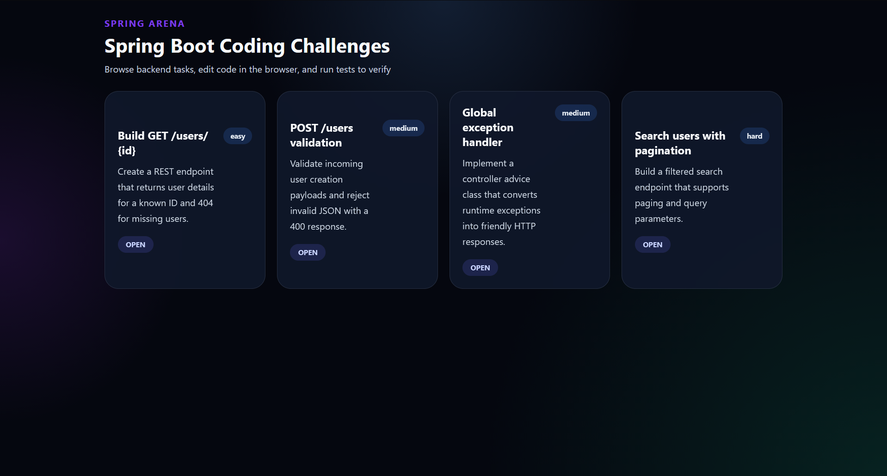
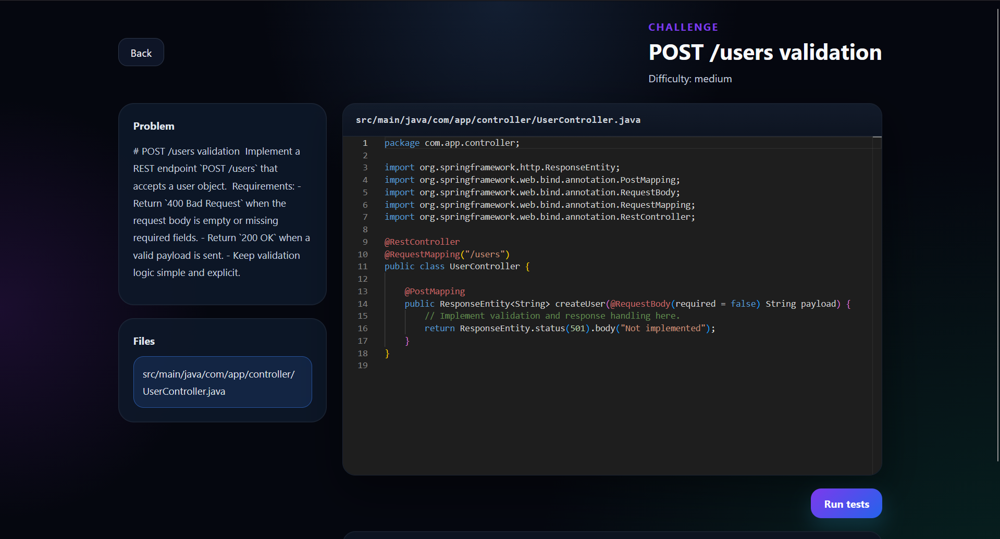

## SpringArena

> Project Version : 0.1 (Pre Release - Build in Progress)

*Spring Arena is an interactive browser-based Spring Boot coding challenge platform. Users solve real backend challenges in a VS Code-like IDE, with instant test-run feedback.*





---

### Quick Start

#### Prerequisites

- Node.js 18+
- Java 17+
- Maven 3.8+

#### How to Run Locally?

**All together:**
```bash
npm install
npm run dev
```

**Separately:**

Terminal 1 (Backend):
```bash
cd backend
mvn spring-boot:run
```

Terminal 2 (Frontend):
```bash
cd frontend
npm run dev
```

Then open: `http://localhost:5173`

### Architecture

```
React Frontend (Browser IDE)
        ↓
Spring Boot Backend API
        ↓
Template + Challenge + User Code
        ↓
Test Execution
        ↓
Result Feedback
```

### Project Structure

```
springarena/
├── frontend/              ## React + Monaco Editor
├── backend/               ## Spring Boot API
├── templates/             ## Reusable Spring Boot bases
├── challenges/            ## Challenge metadata & tests
├── runs/                  ## Temporary execution folders
├── workspace/             ## User progress storage
└── package.json           ## Root scripts
```

### How It Works

1. **User opens dashboard** → Lists all available challenges
2. **User selects challenge** → Problem statement + editable code loaded
3. **User writes code** → Changes reflected in browser editor
4. **User clicks Run** → Code sent to backend
5. **Backend assembles** → Copies template + challenge starter files + user code
6. **Maven runs tests** → JUnit tests execute against user implementation
7. **Results returned** → Pass/fail feedback shown in browser

### Challenges

Each challenge contains:

- `metadata.json` - Title, difficulty, template type
- `prompt.md` - Problem description
- `starter-files/` - Editable code templates
- `tests/` - JUnit test cases

### Backend APIs

| Method | Endpoint | Purpose |
|--------|----------|---------|
| GET | `/api/challenges` | List all challenges |
| GET | `/api/challenges/{id}` | Get challenge details |
| POST | `/api/challenges/{id}/run` | Execute code & run tests |

### Tech Stack

- **Frontend:** React 18, Vite, Monaco Editor, TailwindCSS
- **Backend:** Spring Boot 3, Java 17, Maven
- **Testing:** JUnit 5, MockMvc

---

### Development

#### Adding a New Challenge

1. Create folder: `challenges/challenge-XXX/`
2. Add `metadata.json`:
   ```json
   {
     "id": "challenge-XXX",
     "title": "Challenge Title",
     "difficulty": "easy|medium|hard",
     "template": "rest-template"
   }
   ```
3. Add `prompt.md` with requirements
4. Create `starter-files/` with editable code
5. Create `tests/` with JUnit test cases

#### Debugging

- Backend logs: `backend/target/spring.log`
- Frontend devtools: `localhost:5173` → DevTools
- Test runs: `runs/run-{id}/` (temp folders)

---

### Future Improvement Scope

#### Performance
- Challenge load: <1s
- Test run: <5s (easy), <10s (medium)
- Editor latency: imperceptible

#### Additional Features
- Docker isolated execution
- Leaderboards
- User accounts
- AI hints
- Advanced challenge types

---

Note for Readers : *If you want any feature, raise an Issue with detailed description*